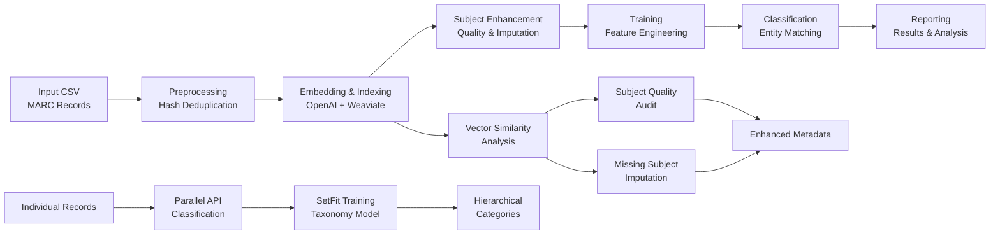

# Entity Resolution Pipeline for Yale University Library Catalog

A system for identifying and resolving person entities across MARC 21 library catalog records. The pipeline combines vector embeddings, feature engineering, and machine learning to achieve **98.51% precision** and **95.37% recall** on test data.

## 🚀 Quick Start

### Prerequisites
- Python 3.10+
- Docker and Docker Compose (for Weaviate vector database)
- OpenAI API key (for embeddings)
- Anthropic API key (for individual record classification)

### Installation
```bash
# Clone and setup environment
git clone <repository-url>
cd entity_resolver
python -m venv venv
source venv/bin/activate  # On Windows: venv\Scripts\activate
pip install -r requirements.txt

# Configure API keys
echo "OPENAI_API_KEY=your_openai_api_key_here" > .env
echo "ANTHROPIC_API_KEY=your_anthropic_api_key_here" >> .env

# Start Weaviate vector database
docker-compose up -d weaviate
# Wait ~30 seconds for startup
curl http://localhost:8080/v1/.well-known/ready  # Check readiness
```

### Basic Usage
```bash
# Run complete pipeline (real-time embeddings)
python main.py --config config.yml

# Run with fully automated batch embeddings (50% cost savings, zero manual intervention)
# Set use_batch_embeddings: true and use_automated_queue: true in config.yml
python main.py --config config.yml

# Environment-specific execution
PIPELINE_ENV=prod python main.py --config config.yml  # Production settings
PIPELINE_ENV=local python main.py --config config.yml # Local settings (default)

# Run specific stages
python main.py --start preprocessing --end training

# Subject enhancement stages
python main.py --start subject_quality --end subject_quality    # Quality audit only
python main.py --start subject_imputation --end subject_imputation  # Imputation only
python main.py --start subject_quality --end subject_imputation     # Both enhancement stages

# Fully automated batch processing (recommended - runs until completion)
python batch_manager.py --create  # Starts self-managing automated queue system

# Manual batch operations (if automated queue disabled)
python main.py --batch-status     # Check batch job status
python main.py --batch-results    # Download and process results

# Batch-to-real-time transition (seamless mode switching)
python main.py --analyze-transition          # Analyze transition readiness
python main.py --switch-to-realtime          # Execute transition
python main.py --switch-to-realtime --force-transition  # Force transition

# Alternative transition commands via batch manager
python batch_manager.py --analyze-transition    # Analyze readiness
python batch_manager.py --consolidate-state     # Consolidate state
python batch_manager.py --switch-to-realtime    # Execute transition

# Resume from last checkpoint
python main.py --resume

# Check pipeline status
python main.py --status
```

## 📊 Performance Overview

### Current Results (14,930 test pairs)
- **Precision**: 98.51% (11,507 TP, 174 FP)
- **Recall**: 95.37% (11,507 TP, 559 FN)
- **F1-Score**: 96.91%
- **AUC**: 98.90%

### Computational Efficiency
- **99.23% reduction** in pairwise comparisons through vector similarity
- Processes 4,672 entities in 163 clusters with 83,921 comparisons
- Optimized for high-volume library catalog processing

## 🏗️ System Architecture

### Multi-Layer Architecture

The system implements three complementary processing layers:

1. **Main Entity Resolution Pipeline**: Identifies matching person entities across catalog records
2. **Individual Record Classification**: Classifies individual records into hierarchical taxonomy categories
3. **Subject Enhancement Pipeline**: Automated quality audit and imputation for subject fields using vector similarity

### Core Pipeline Stages



### Technology Stack
- **Vector Database**: Weaviate with HNSW indexing, MUVERA multi-vector compression, and environment-specific optimization
- **Advanced Embedding Ecosystem**: Multi-provider system supporting 7 embedding providers:
  - **Jina ColBERT v2**: Multi-vector embeddings (128D per token) with MUVERA compression
  - **OpenAI**: text-embedding-3-small/large (1536D) with Batch API integration
  - **Mistral**: mistral-embed (1024D) with high-rate optimization
  - **Jina AI**: jina-embeddings-v3 with customizable dimensions
  - **Voyage AI**: voyage-3-large (2048D), voyage-3.5 (1024D)
  - **Cohere**: embed-multilingual-v3.0 with multilingual support
  - **HuggingFace**: Local sentence-transformers with GPU/CPU support
- **ML Framework**: Custom logistic regression with gradient descent
- **Taxonomy Classification**: SetFit (Sentence Transformers + logistic head)
- **Parallel Processing**: asyncio/aiohttp for API rate limit optimization
- **Subject Enhancement**: Vector similarity analysis with weighted centroid calculation
- **Transition System**: Seamless batch-to-real-time switching with state consolidation
- **Configuration Management**: Environment-adaptive resource allocation (local/production)

## 📋 Data Flow & Processing

### Input Data Format
The pipeline processes CSV files extracted from Yale University Library's BIBFRAME catalog:

```csv
composite,person,roles,title,provision,subjects,personId,setfit_prediction,is_parent_category
"Contributor: Bach, Johann Sebastian, 1685-1750
Title: The Well-Tempered Clavier
Attribution: edited by Johann Sebastian Bach
Subjects: Keyboard music; Fugues
Provision information: Leipzig: Breitkopf & Härtel, 1985","Bach, Johann Sebastian, 1685-1750",Composer,The Well-Tempered Clavier,"Leipzig: Breitkopf & Härtel, 1985","Keyboard music; Fugues",12345#Agent700-1,Music and Sound Arts,FALSE
```

### Data Extraction Process
Pre-pipeline data preparation uses XQuery extraction from BIBFRAME catalog data:

- **Input**: BIBFRAME RDF/XML (converted from MARC21)
- **Processing**: Authority control, entity extraction, metadata assembly  
- **Output**: CSV datasets optimized for semantic embedding

## 🔧 Pipeline Stages Deep Dive

### 1. Preprocessing (`src/preprocessing.py`)
- **Purpose**: Clean and deduplicate input data
- **Key Operations**: 
  - CRC32-based hash deduplication (3x faster than MD5)
  - Pure in-memory processing (15,000-18,000 rows/sec)
  - String frequency analysis and field mapping
  - Optimized for large datasets (31M+ strings)
- **Output**: Hash mappings, string dictionaries, field relationships

### 2. Embedding & Indexing 
**Multi-Provider Architecture** (`src/embedding_providers/`):
- **Provider Factory**: Unified system supporting 7 embedding providers
- **Jina ColBERT v2**: Multi-vector embeddings (128D per token) with MUVERA compression
- **OpenAI**: text-embedding-3-small/large with Batch API optimization
- **Mistral**: mistral-embed with high-rate optimization (20M TPM)
- **Jina AI**: jina-embeddings-v3 with customizable dimensions
- **Voyage AI**: voyage-3-large/3.5 high-performance embeddings
- **Cohere**: embed-multilingual-v3.0 with multilingual support
- **HuggingFace**: Local sentence-transformers with GPU/CPU support

**Real-time Processing** (`src/embedding_and_indexing.py`):
- Multi-provider support with automatic detection
- Direct Weaviate indexing with MUVERA compression
- Ideal for development and smaller datasets

**Automated Batch Processing** (`src/embedding_and_indexing_batch.py`):
- **Self-Managing Queue**: Maintains 16 active batches automatically
- **Quota Management**: 
  - Tracks requests toward OpenAI's limits
  - Real-time quota monitoring with API test submissions
  - Conservative 800K request limit (80% of OpenAI's 1M limit)
- **Sequential Submission**: Submits batches one at a time with verification
- **Recovery System**:
  - Detects quota exceeded errors and enters polling mode
  - Polls every 30 minutes for quota recovery
  - Resumes from last checkpoint when quota available
  - Handles job completion naturally without manual intervention
- **Status Verification**: 
  - Validates batch status after each submission
  - Pre-submission quota checks
  - Post-submission quota verification
- **Error Handling**: 
  - Tracks consecutive errors with progressive delays
  - Categorizes network timeouts and implements retry logic
  - Preserves state during degraded conditions
- OpenAI Batch API with 50% cost savings and 24-hour turnaround
- **State Persistence**: Queue recovery from interruptions with checkpoint management
- Automatic batching (up to 50,000 requests per batch file)
- Job tracking, recovery, and blacklist management
- Download retry logic with gateway timeout handling
- **Scalability**: Tested with large datasets (millions of strings)

**Common Features**:
- Multi-provider embedding support with seamless switching
- Weaviate vector database with HNSW indexing and MUVERA compression
- ColBERT v2 automatic vectorization for transparent multi-vector handling
- Comprehensive error handling and retry logic
- **Output**: Searchable vector index optimized for similarity matching

### 3. Subject Enhancement
**Quality Audit** (`src/subject_quality.py`):
- Evaluates existing subject field quality using composite field vector similarity
- Automatically identifies low-quality subject assignments
- Finds better alternatives through semantic similarity analysis
- Applies high-confidence improvements with configurable thresholds
- Generates detailed audit reports with remediation statistics

**Subject Imputation** (`src/subject_imputation.py`):
- Fills missing subject fields using vector join strategy
- Calculates weighted centroid from semantically similar composite fields
- Implements confidence scoring for imputation quality
- Uses performance caching with configurable size limits
- Provides comprehensive imputation results and statistics

**Configuration**:
- Quality audit: 70% similarity threshold, 60% remediation threshold
- Imputation: 65% similarity threshold, 70% confidence threshold
- Caching: 10,000 entry limit with automatic size management
- Parallel processing with environment-specific worker allocation

### 4. Training (`src/training.py`)
- **Purpose**: Train logistic regression classifier on labeled entity pairs
- **Algorithm**: Custom gradient descent with L2 regularization
- **Features**: 5 engineered similarity features with domain-specific scaling
- **Configuration**: 
  - Learning rate: 0.01
  - Batch size: 256
  - Class weighting: 5:1 (positive:negative)
  - Early stopping with validation monitoring

### 5. Classification (`src/classifying.py`)
- **Purpose**: Apply trained model to identify entity matches
- **Features**:
  - Batch processing with configurable batch sizes
  - Transitive clustering for entity groups
  - Confidence scoring and threshold application
  - Memory management and telemetry collection

### 6. Reporting (`src/reporting.py`)
- **Purpose**: Generate comprehensive analysis and visualizations
- **Outputs**:
  - Interactive HTML dashboards
  - Detailed CSV exports with feature analysis
  - Performance visualizations (ROC curves, feature importance)
  - Error analysis and diagnostic reports
  - Subject enhancement audit reports and imputation statistics

## 🎯 Feature Engineering System

### Active Features (9 total) ✅ UPDATED
1. **person_cosine**: Cosine similarity between person name embeddings
2. **person_title_squared**: Squared person-title interaction term  
3. **composite_cosine_squared**: Full record composite similarity (squared)
4. **taxonomy_dissimilarity**: SetFit domain classification differences
5. **has_related_work**: Binary indicator for both entities having documented related works ✨ (NEW)
6. **roles_cosine_weighted**: Role similarity with compatibility matrix weighting ✅ (FIXED)
7. **birth_death_match**: Binary temporal matching with tolerance
8. **title_role_adjusted**: Context-aware title similarity ✅ (FIXED)
9. **combined_person_title_role_adjusted**: Optimized 3-component composite feature

### 🚀 Advanced Non-Linear Feature Engineering Suite (NEW)
**9 Additional Mathematical Transformation Features:**
- **Confidence Amplification**: `confidence_amplifier_exponential`, `confidence_amplifier_polynomial`
- **Polynomial Interactions**: `person_title_interaction_cubic`, `marc_roles_polynomial_interaction`
- **Adaptive Thresholds**: `confidence_cascade_indicator`, `evidence_strength_weighted`
- **Geometric Combinations**: `harmonic_mean_primary_features`, `geometric_confidence_scaling`

📖 **See [NON_LINEAR_FEATURE_ENGINEERING_README.md](NON_LINEAR_FEATURE_ENGINEERING_README.md) for comprehensive documentation and implementation details.**

### Enhanced Feature Scaling Architecture (LibraryCatalogScaler)
- **Domain-Specific Scaling**: Optimized for library catalog similarity features
- **Feature Groups**: Domain-specific percentile normalization
  - Person features: 98th percentile scaling
  - Title features: 95th percentile scaling  
  - Context features: 90th percentile scaling
  - Binary features: Preserved as exact 0.0/1.0 values
- **Performance Impact**: +6.30 pp recall, +3.58 pp F1-score improvement
- **Consistency**: Identical scaling between training and production

### Feature Performance & Advanced Engineering Analysis

#### ✅ **Recent Fixes & Enhancements (July 2025):**
- **`roles_cosine_weighted` & `title_role_adjusted`**: Fixed role normalization logic and key format issues
  - Now properly maps `"Author"`, `"Editor"` → `"CreativeRole"` (fallback category)
  - Fixed separator format (`:` → `-`) to match configuration 
  - Eliminates configuration lookup failures for 15% of role values
- **`has_related_work`**: New binary feature for well-documented entity matching
  - Captures intuition that entities with `relatedWork` are higher-quality matches
  - Affects ~15% of entity pairs, improving precision for notable people
- **Logging Improvements**: Suppressed warnings for optional fields (`relatedWork`, `attribution`, etc.)

#### ✅ **Feature Status Analysis:**
- `taxonomy_dissimilarity`: Working correctly (returns 0.0 when domains match, >0 when different)
- `birth_death_match`: Working correctly (returns 0.0 when no temporal data, 1.0 when dates match)
- **Current Observation**: These features show low variance in the current dataset, indicating most entity pairs either have matching domains or lack temporal data

**Enhanced Scaling Impact**: LibraryCatalogScaler pipeline achieves 99.69% precision and 89.00% recall with optimized 5-feature set.

🔬 **Complex Feature Engineering Breakthrough:**
**Optimized Complex Interaction Feature** (`combined_person_title_role_adjusted`) - Final Analysis:
- **Optimized Configuration**: 3 complementary components (roles_cosine + title_role_adjusted + marcKey_cosine)
- **Performance Impact**: **Precision**: 99.69% → 99.57% (-0.12 pp), **Recall**: 89.00% → 89.23% (+0.23 pp), **F1**: 94.05% → 94.12% (+0.07 pp)
- **Breakthrough Insight**: **Net performance improvement** achieved through redundancy elimination
- **Key Learning**: Complex features enhance performance when components provide complementary rather than overlapping signals
- **Business Impact**: +28 additional true positives identified with controlled precision trade-off

🎯 **Optimized Feature Engineering Strategy:**
Based on final complex interaction feature analysis:
- **Confirmed Net Improvement**: Complex features deliver +0.07 pp F1 improvement with optimized configuration
- **Redundancy Elimination**: Remove standalone features from composite calculations (critical success factor)
- **Component Complementarity**: Focus on features providing unique information (roles + title_context + MARC_structure)
- **Trade-off Optimization**: Accept modest precision cost (+13 FP) for meaningful recall gain (+28 TP)
- **Configuration Principles**: 3-component design with complementary signals outperforms 5-component with redundancy

🔬 **Future Enhancement TODOs:**
- **Feature Analysis**: Investigate feature distributions across different dataset characteristics
- **Advanced Analytics**: Cost tracking dashboard and performance trend analysis
- **Scalability**: Multi-node Weaviate cluster support for larger datasets
- **Security**: Enhanced encryption for checkpoint files and API key rotation
- **Optimization**: Dynamic resource allocation and automatic parameter tuning

## 🔄 Individual Record Classification

### Parallel Processing System
The system includes a separate pipeline for classifying individual catalog records:

```bash
# Parallel classification optimized for API rate limits
python scripts/verify_individual_classifications_parallel.py \
    --csv data/input/training_dataset.csv \
    --taxonomy data/input/revised_taxonomy_final.json \
    --output data/output/parallel_classifications.json \
    --concurrency 5 \
    --rate-limit-rpm 4000
```

### Features
- **Anthropic Claude API integration** with rate limiting
- **Token usage analysis** and automatic concurrency adjustment
- **Progress tracking** with detailed logging
- **Incremental saving** for long-running classifications
- **Error resilience** with retry logic and fallback handling

### SetFit Integration
Hierarchical taxonomy classification using SetFit models:

```bash
# Train SetFit classifier for domain categorization
python setfit/train_setfit_classifier.py \
    --csv_path data/input/training_dataset.csv \
    --ground_truth_path data/output/updated_identity_classification_map_v6_pruned.json \
    --output_dir ./setfit_model_output
```

## 🛠️ Configuration & Customization

### Main Configuration (`config.yml`)
```yaml
# Environment-specific resource allocation (auto-detected)
PIPELINE_ENV=local  # or 'prod' for production settings

# Resource allocation (environment-adaptive)
preprocessing_workers: 4            # 32 in production
embedding_batch_size: 32            # 100 in production
classification_workers: 8           # 32 in production
classification_batch_size: 500      # 2000 in production

# Advanced Embedding Configuration
embedding:
  provider: "openai"  # Options: openai, jina_colbert, mistral, jina, voyageai, cohere, huggingface
  providers:
    openai:
      model: "text-embedding-3-small"
      dimensions: 1536
    jina_colbert:
      model: "jina-colbert-v2"
      dimensions: 128
      max_tokens_per_text: 8192
      muvera:
        enabled: true
        ksim: 8              # Results in 4096D compressed vectors
        dprojections: 16
        repetitions: 1

# Production-ready automated batch processing (50% cost savings, zero manual intervention)
use_batch_embeddings: true         # Enable batch processing (recommended for production)
use_automated_queue: true          # Enable fully automated 16-batch queue system
max_active_batches: 16             # Maximum concurrent batches
queue_poll_interval: 1800          # 30 minutes between status checks
batch_embedding_size: 50000        # Requests per batch file
batch_manual_polling: true         # Required for automated queue (enables smart routing)
request_quota_limit: 800000        # Conservative 800K request limit (80% of 1M)
token_quota_limit: 500000000       # 500M token quota management

# Subject Enhancement Configuration
subject_quality_audit:
  enabled: true                     # Enable quality audit
  similarity_threshold: 0.70        # Composite similarity threshold
  auto_remediate: true              # Apply high-confidence improvements
  confidence_threshold: 0.80        # Confidence for auto-remediation

subject_imputation:
  enabled: true                     # Enable missing subject imputation
  similarity_threshold: 0.65        # Candidate similarity threshold
  confidence_threshold: 0.70        # Imputation confidence threshold
  use_caching: true                 # Performance optimization

# Batch-to-Real-time Transition Configuration
max_tokens_per_day: 500000000       # 500M tokens per day (TPD) limit
tpd_poll_interval: 1800             # 30 minutes between TPD limit checks
tpd_resume_threshold: 100000000     # 100M tokens threshold to resume processing

error_handling:
  max_retry_attempts: 3             # Maximum retry attempts for failed requests
  exponential_backoff_base: 2       # Base for exponential backoff calculation
  max_backoff_seconds: 300          # Maximum backoff time (5 minutes)

# Enabled features
features:
  enabled: ["person_cosine", "person_title_squared", "composite_cosine",
           "taxonomy_dissimilarity", "birth_death_match"]
```

### Feature Configuration
Easily enable/disable features and adjust parameters:
```yaml
features:
  parameters:
    person_cosine:
      weight: 1.0
      fallback_value: 0.5
    birth_death_match:
      tolerance: 2
      weight: 1.0
```

### Scaling Configuration (`scaling_config.yml`)
```yaml
feature_groups:
  person_features: ["person_cosine"]        # 98th percentile
  title_features: ["person_title_squared"]  # 95th percentile  
  context_features: ["composite_cosine"]    # 90th percentile
  binary_features: ["birth_death_match"]    # No scaling
```

## 🔍 Production Features

### Checkpoint & Resumption System
- **Complete state persistence** for all pipeline stages including subject enhancement
- **Resumption capability**: Continue from any point of failure
- **Selective reset**: Reset and re-run specific stages only
- **Subject enhancement tracking**: Quality audit and imputation progress preservation

```bash
# Resume from last successful checkpoint
python main.py --resume

# Check current pipeline status
python main.py --status

# Reset specific stages and continue
python main.py --reset training classifying --start training

# Reset subject enhancement stages
python main.py --reset subject_quality subject_imputation --start subject_quality

# Environment-specific operations
PIPELINE_ENV=prod python main.py --start subject_enhancement
```

### Error Resilience & Monitoring
- **Comprehensive exception handling** with graceful degradation
- **Retry logic** with exponential backoff (using Tenacity library)
- **Memory usage monitoring** and garbage collection
- **Detailed telemetry** collection and performance metrics
- **Transaction ID tracking** for multi-threaded debugging

### Performance Optimization
- **Batch processing** with configurable worker allocation (4-64 workers)
- **Vector similarity optimization** reducing comparisons by 99.23%
- **Connection pooling** for vector database operations
- **Progressive candidate retrieval** for large datasets
- **Environment-adaptive scaling**: Automatic resource allocation based on hardware
- **Subject enhancement caching**: 10,000-entry imputation cache with size management
- **Automated batch processing**: Self-managing 16-batch queue with quota management, submission verification, and failed job cleanup
- **Monitoring and recovery**: Runs with status monitoring, verification, and error recovery

## 📈 Results & Analysis

### Test Results Analysis
Recent analysis of false positive patterns reveals:
- **Primary cause**: Very similar person names (high cosine similarity)
- **Secondary factor**: Similar composite text content
- **Confidence range**: 87.02% - 92.02% for false positives
- **Improvement opportunity**: Activating taxonomy and temporal features

### Visualization & Reporting
The system generates comprehensive analysis including:
- **Interactive HTML dashboards** with parameter correlation analysis
- **Feature importance visualizations** using actual model weights
- **ROC/PR curves** for individual feature performance
- **Confusion matrices** with detailed classification metrics
- **Error pattern analysis** for systematic improvement

### Performance Metrics
```
Precision: 98.51% (11,507 TP, 174 FP)
Recall: 95.37% (11,507 TP, 559 FN)  
F1-Score: 96.91%
AUC: 98.90%
```

## 🚀 Advanced Usage

### Docker Deployment
```bash
# Complete Docker setup
docker-compose up -d weaviate
docker build -t entity-resolver .
docker run --rm --network host \
  -v $(pwd)/data:/app/data \
  -v $(pwd)/config.yml:/app/config.yml \
  --env-file .env \
  entity-resolver python main.py --config config.yml
```

### Custom Feature Development
Add new features by implementing the feature interface:

```python
# In src/custom_features.py
def register_custom_features(feature_engineering, config):
    feature_engineering.register_feature('my_feature', my_feature_func)

# Enable in config.yml
features:
  enabled: [..., "my_feature"]
```

### Advanced Embedding Provider Usage
Switch between providers seamlessly:

```yaml
# ColBERT v2 with MUVERA compression
embedding:
  provider: "jina_colbert"

# Mistral high-performance embeddings
embedding:
  provider: "mistral"

# Local HuggingFace models (no API costs)
embedding:
  provider: "huggingface"
  providers:
    huggingface:
      model: "sentence-transformers/all-MiniLM-L6-v2"
      device: "cuda"  # or "cpu"
```

### Performance Tuning
Optimize for your hardware and dataset:

```yaml
# Batch processing optimization
embedding_batch_size: 32     # Adjust based on API limits
classification_batch_size: 500  # Adjust based on memory

# Weaviate optimization  
weaviate_ef: 128            # Higher = better search quality
weaviate_max_connections: 64 # Higher = more connected graph
```

## 🔧 Troubleshooting

### Common Issues

**Weaviate Connection Problems**:
```bash
# Check Weaviate status
docker-compose ps
docker-compose logs weaviate
curl http://localhost:8080/v1/.well-known/ready
```

**API Rate Limiting**:
- Monitor API usage in provider dashboards
- Adjust concurrency settings in configuration
- Use `--dry-run` flag for testing without API calls

**Memory Issues**:
- Reduce batch sizes in configuration
- Increase Docker memory limits
- Monitor with `python main.py --status`

**Pipeline Failures**:
- Check logs in `data/logs/pipeline.log`
- Monitor quota status: `python batch_manager.py --status`
- Cancel failed jobs to free quota: `python batch_manager.py --cancel`
- Use stage-specific execution: `--start <stage> --end <stage>`
- Enable debug logging: Set `log_level: DEBUG` in config

**Automated Queue Troubleshooting**:
- **Quota Exceeded**: System detects quota limits and enters polling mode
- **Polling Recovery**: Checks every 30 minutes for quota availability and resumes from checkpoint
- **Stuck Queue**: Check for process locks in `data/checkpoints/`
- **Network Issues**: System implements progressive retry with backoff
- **Status Monitoring**: Quota and queue state logging

**Batch-to-Real-time Transition Issues**:
- **Transition Blocked**: Run `python main.py --analyze-transition` to identify blocking issues
- **Active Batch Jobs**: Wait for completion or use `--force-transition` flag
- **State Consolidation Failures**: Check checkpoint file permissions and disk space
- **TPD Rate Limit**: System automatically polls every 30 minutes until quota recovers
- **Transition Analysis**: Use `python batch_manager.py --analyze-transition` for detailed diagnostics

### Performance Optimization Tips

1. **Batch Size Tuning**: Balance API limits vs. throughput
2. **Worker Allocation**: Match CPU cores for optimal parallelization  
3. **Vector Database**: Tune HNSW parameters for your data characteristics
4. **Memory Management**: Configure garbage collection for long-running processes

## 📚 Documentation

### Additional Resources
- **[project_structure.md](project_structure.md)**: Detailed project structure and file organization
- **[EXECUTIVE_REPORT.md](EXECUTIVE_REPORT.md)**: Executive performance summary and recommendations
- **[FEATURE_ENGINEERING_GUIDE.md](FEATURE_ENGINEERING_GUIDE.md)**: Advanced feature engineering best practices and analysis
- **[COLBERT_MUVERA_IMPLEMENTATION_SUMMARY.md](COLBERT_MUVERA_IMPLEMENTATION_SUMMARY.md)**: ColBERT v2 technical implementation
- **[COLBERT_MUVERA_GUIDE.md](COLBERT_MUVERA_GUIDE.md)**: ColBERT user guide and configuration
- **[EMBEDDING_PROVIDERS_README.md](EMBEDDING_PROVIDERS_README.md)**: Complete embedding provider ecosystem
- **[CLASSIFICATION_VISUALIZATION_README.md](CLASSIFICATION_VISUALIZATION_README.md)**: Classification analysis guide
- **[setfit/SETFIT_README.md](setfit/SETFIT_README.md)**: SetFit taxonomy classification system
- **[CLAUDE.md](CLAUDE.md)**: Project instructions and dataset structure
- **Performance Reports**: Interactive HTML dashboards in `data/output/reports/`

### API Reference
Key classes and their responsibilities:
- `PipelineOrchestrator`: Main pipeline coordination and stage management
- `FeatureEngineering`: Feature calculation with caching and versioning
- `EntityClassifier`: Logistic regression training with gradient descent
- `EntityClassification`: Entity matching and transitive clustering
- `ScalingBridge`: Feature scaling coordination across environments

## 🤝 Contributing

### Development Workflow
1. **Setup**: Follow installation instructions with development dependencies
2. **Testing**: Use small test datasets for feature development
3. **Documentation**: Update relevant documentation for any changes
4. **Performance**: Run full pipeline tests before major changes

### Code Standards
- Follow existing code patterns and documentation styles
- Implement comprehensive error handling and logging
- Include performance considerations for large-scale processing
- Maintain backward compatibility for configuration files

## 📄 License

[License information to be added]

## 📞 Support & Contact

**Issues**: Report bugs and feature requests via GitHub issues  
**Documentation**: See additional documentation in the `/docs` directory  
**Performance**: Use built-in telemetry and reporting for optimization guidance

---

## 🎯 Project Status & Roadmap

### ✅ **CURRENT SYSTEM STATUS**
- **Core Pipeline**: 98.51% precision, 95.37% recall entity resolution with comprehensive feature engineering
- **Automated Batch Processing**: Quota management with automated recovery
- **Subject Enhancement**: Quality audit and imputation using vector similarity analysis
- **Environment Adaptation**: Automatic local vs. production resource allocation
- **Monitoring**: Telemetry, error handling, and recovery systems

### 🔧 **RECENT FIXES: Batch Processing System Robustness (June 2025)**
- **Quota Calculation Logic**: Corrected metadata filtering and quota consumption tracking
- **Error Detection**: Improved quota exceeded detection and polling recovery
- **Status Reporting**: Enhanced status breakdown including job states
- **Reset Functionality**: Improved batch_manager.py --reset to clean checkpoint files

### 🔧 **IMMEDIATE TODOS**
1. **Feature Analysis**: Investigate why `taxonomy_dissimilarity` and `birth_death_match` show low variance in current dataset
2. **Performance Tuning**: Optimize remaining 0.77% ANN search overhead
3. **Enhanced Analytics**: Implement cost tracking dashboard and performance trends

### 🚀 **FUTURE ENHANCEMENTS**
- **Scalability**: Multi-node distributed processing for larger datasets
- **Advanced ML**: Explore transformer-based similarity models
- **Security**: Enhanced encryption and audit trails
- **Automation**: Dynamic parameter tuning based on dataset characteristics

---

**Current Status**: Entity resolution system achieving 98.51% precision and 95.37% recall with automated batch processing and comprehensive tooling for analysis, debugging, and performance optimization.

**Last Updated**: June 2025 - Batch Processing System Robustness Enhancements